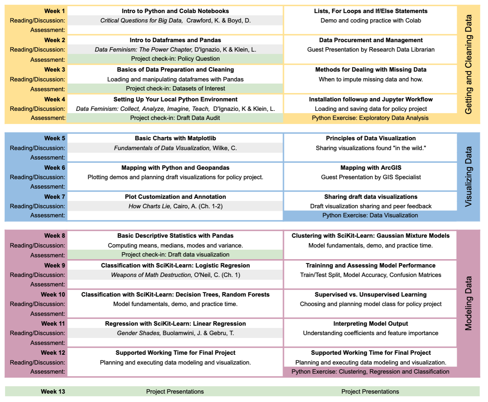

This course provides an overview of the principles and applications of data science. The first part of the
course deals with the acquisition and handling of data, with an emphasis on contextualizing data and framing
data analysis. The second part of the course will focus on tools and techniques for data manipulation and
visualization. The third part of the course will introduce students to several methods for modeling data.
The course will present both theoretical frame-works and practical tools for implementing various algorithms
for regression, classification, and clustering. Students will become proficient in Python based tools for data
analysis including numpy, pandas, and scikit-learn. 

### Essential Questions
The organizing questions for the three sections of the
course are:
1. Getting and Cleaning Data
- Where does data come from and how do we make it useful?
- What is data?
- How do the tools we use obscure the data or help us understand the data more deeply?
- What are the human choices involved with analyzing and presenting data?
2. Visualizing Data and Communicating Findings
- What are the human choices involved with analyzing and presenting data?
- How can data analysis and visualization inform policy? How can it mislead?
- How can we communicate effectively about data (with different audiences)?
- How do the tools we use obscure the data or help us understand the data more deeply?
3. Modeling Data
- How do we validate modeling choices? Once I build a model, how do I know whether it’s good
or not?
- Why do we model data? What can models help us to achieve or learn?
- What kinds of assumptions do we make when we build a model? How can models mislead?

## Semester schdedule

## Materials

[Instructions](https://karinknudson.com/python_setup.pdf) for getting set up with Python, Jupyter and conda on your own computer

### Colab notebooks for in-class demos and exercises

- [Introduction to Python Basics](https://colab.research.google.com/drive/1zok05G-2A9_UzmkIIWT_anl2dvps__M0?usp=sharing)
- [Introduction to Dataframes](https://colab.research.google.com/drive/1F4PbNbznY_p6X4vdy-e7uZ2LN7u-yv1h?usp=sharing)
- [Data Preparation with Python](https://colab.research.google.com/drive/1wWRIlHSSAqgX0HWf4dF_kRZ5YLYHtdbf?usp=sharing) and [Sample Solutions](https://colab.research.google.com/drive/1PTBGxQQZWCj7yRkUlmAL64CrA0qMLnbd?usp=sharing)
- [Classic Charts with Matplotlib](https://colab.research.google.com/drive/1-UU6SiDJ3_HhqwH0H9NJylZ-Vllt0TKB?usp=sharing) and [Sample Solutions](https://colab.research.google.com/drive/1u72oiWHIIxfqeSoH3RM_-ZlY-DXvZM8U#scrollTo=NV1g9QdthpSs)
- [Maps with Python](https://colab.research.google.com/drive/1R4ekzzVhbasFSJ1OQsDNdrn_uI7NQkov?usp=sharing#scrollTo=BKRaBYdB836u)
- [Radial Charts with Python](https://colab.research.google.com/drive/1BVURjLt88Gm55xrTq1r4AS2sMo9cC-Ee?usp=sharing)
- [Introduction to Modeling with Python](https://colab.research.google.com/drive/1YQMSGcudX_z9WphueXi1Tzwq5muzmo2_?usp=sharing)
- [Introduction to Classification](https://colab.research.google.com/drive/1uE3Qh6Lm9h8m0EWSUc1hwVQkp2IQb9CF?usp=sharing)
- [Classification and Regression with K Nearest Neighbors](https://colab.research.google.com/drive/1PTFpYeNFbyUY0Ig_gXrpADjRaEnXiL3A?usp=sharing)

### Colab notebooks for Python exercises
- [Exercise: Exploratory Data Analysis in Python](https://colab.research.google.com/drive/1CAP_k6HF88O-19wngS_5x2KN7Sfiwypo)
- [Exercise: Data Visualization in Python](https://colab.research.google.com/drive/14WX9amWra-ChZj_PO6J37zrFc_sDRQ0J?usp=sharing)
- [Exercise: Clustering, Regression, and Classification with Python](https://colab.research.google.com/drive/18yqgvYmSoe6RKHjf_B4Sgb-J0CL4UwUX?usp=sharing)

### Readings and journal prompts

[Readings and journal prompts](journal-prompts)

### Project

  - [Project Check-in: Policy Question](policy_question)
  - [Project Check-in: Identifying Datasets of Interest](datasets_of_interest)
  - [Project Check-in: Data Audit](data_audit)
  - [Project Check-in: Draft Data Visualization](draft_data_visualization)
  - [Final Submission Assigment and Rubric](project_assigment_and_rubric)

## License

 These materials for Data Science for Global Applications are licensed under a <a rel="license" href="http://creativecommons.org/licenses/by-nc/4.0/">Creative Commons Attribution-NonCommercial 4.0 International License</a>.

